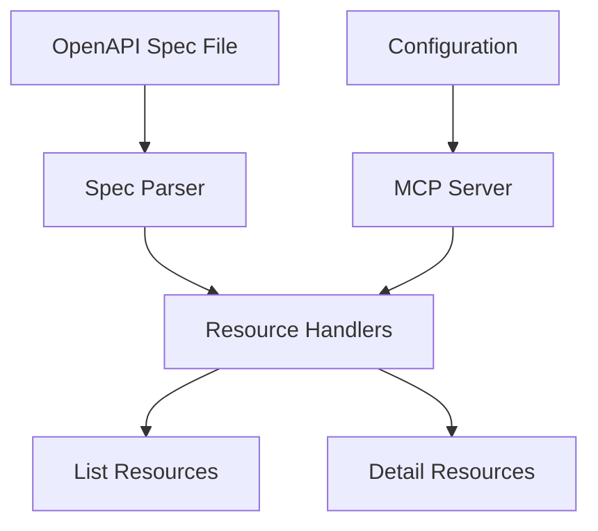

# System Patterns

## Architecture Overview

## Resource Design Patterns

### URI Structure
- Static Resources:
  - `openapi://endpoints/list` - List all endpoints
  - `openapi://schemas/list` - List all schemas

- Dynamic Resources:
  - `openapi://schema/{name}` - Get schema details
  - `openapi://endpoints/{method}/{segment1}/{segment2}/...` - Get endpoint details

### Response Format Patterns
1. List responses focus on conciseness
2. Detail responses provide comprehensive information
3. All responses use clear, consistent structures

## Extension Points
1. Parser layer for supporting different spec formats
2. Resource handler layer for new resource types
3. Configuration layer for future remote spec support

## Testing Strategy
1. Unit tests for individual components
2. Integration tests for resource handlers
3. E2E tests for complete server functionality
4. Test fixtures with sample OpenAPI specs
