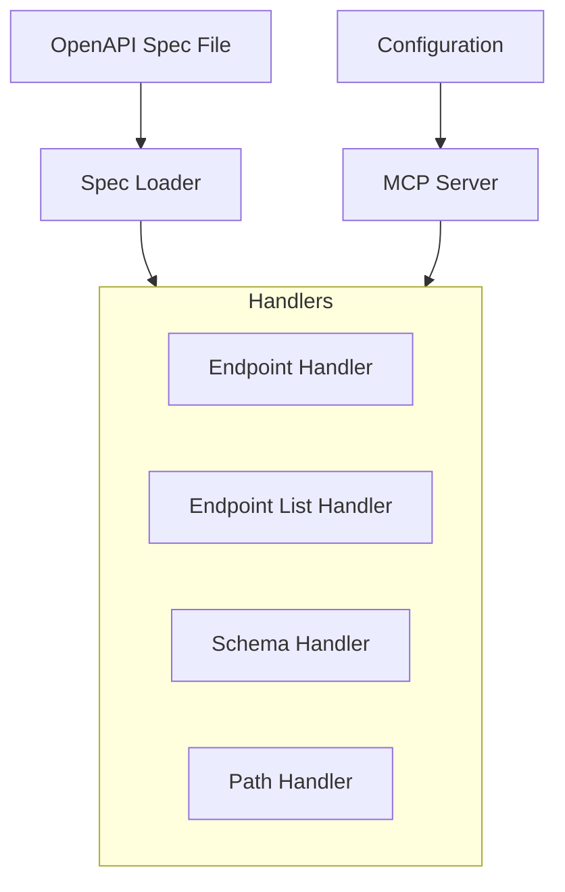

# System Patterns

## Architecture Overview

## Component Structure

### Services Layer
- SpecLoader: Loads and parses OpenAPI specifications
  - Uses swagger-parser for validation
  - Provides typed access to spec data
  - Handles file loading and caching

### Handler Layer
- EndpointHandler: Dynamic endpoint details
  - Multiple methods and paths support
  - Error handling with isError
  - Path normalization
  - Method completion

- EndpointListHandler: Token-efficient listing
  - Text/plain format
  - Sorted method groups
  - Consistent output

### Configuration Layer
- Environment variables validation
- Server configuration
- Spec file path management

## Resource Design Patterns

### URI Structure
- Dynamic Resources:
  - `openapi://endpoint/{method}/{path}` - Get endpoint details
  - `openapi://endpoints/list` - Get all endpoints
  - `openapi://schema/{name}` - Get schema details

### Response Format Patterns
1. Token-Efficient Formats:
   - text/plain for lists
   - JSON for detailed views
   - YAML planned for optimization
2. Error Handling:
   - isError flag for errors
   - Consistent error structure
   - Informative messages
3. Type Safety:
   - Strong typing with OpenAPI v3
   - Type guards for responses
   - Error type validation

## Extension Points
1. Response formats (JSON/YAML)
2. Resource handlers
3. URI resolution for $refs
4. Parameter validation

## Testing Strategy
1. Unit Tests
   - Handler tests with type safety
   - Error handling scenarios
   - Multiple values support
   - Path normalization

2. Integration Tests
   - Resource handler cooperation
   - Error propagation
   - Type validation

3. E2E Tests
   - Full resource functionality
   - Complex paths and methods
   - Error scenarios
   - Response format validation

4. Test Support
   - Type-safe fixtures
   - Mock OpenAPI specs
   - Helper utilities
   - Response validation
