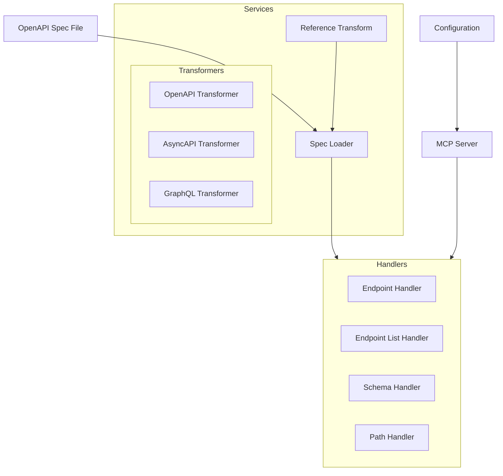

# System Patterns

## Architecture Overview

## Component Structure

### Services Layer
- SpecLoader: Loads and transforms OpenAPI specifications
  - Parses spec without resolving references
  - Integrates with reference transformation
  - Provides typed access to spec data
  - Handles file loading and caching

- ReferenceTransform: Manages reference transformations
  - Format-agnostic transformer interface
  - OpenAPI reference transformation
  - Type-safe implementation
  - Extensible for other formats

### Handler Layer
- EndpointHandler: Dynamic endpoint details
  - Multiple methods and paths support
  - Error handling with isError
  - Path normalization
  - Method completion

- EndpointListHandler: Token-efficient listing
  - Text/plain format
  - Sorted method groups
  - Consistent output

### Configuration Layer
- Environment variables validation
- Server configuration
- Spec file path management

## Resource Design Patterns

### URI Structure
- Resource URIs:
  - `openapi://endpoint/{method}/{path}` - Get endpoint details
  - `openapi://endpoints/list` - Get all endpoints
  - `openapi://schema/{name}` - Get schema details

- Reference URIs:
  - `openapi://schema/{name}` - Schema reference
  - `openapi://parameter/{name}` - Parameter reference
  - `openapi://response/{name}` - Response reference

### Response Format Patterns
1. Token-Efficient Formats:
   - text/plain for lists
   - JSON for detailed views
   - YAML planned for optimization
2. Error Handling:
   - isError flag for errors
   - Consistent error structure
   - Informative messages
3. Type Safety:
   - Strong typing with OpenAPI v3
   - Type guards for responses
   - Error type validation

## Extension Points
1. Reference Transformers:
   - AsyncAPI transformer
   - GraphQL transformer
   - Custom format transformers

2. Resource Handlers:
   - Schema resource handler
   - Additional reference handlers
   - Custom format handlers

3. URI Resolution:
   - Reference resolution
   - Cross-resource linking
   - External references

4. Validation:
   - Parameter validation
   - Reference validation
   - Format-specific validation

## Testing Strategy
1. Unit Tests
   - Handler tests with type safety
   - Reference transformation tests
   - Format-specific tests
   - Edge case handling

2. Integration Tests
   - Service cooperation
   - Reference resolution
   - Cross-format handling
   - Error propagation

3. E2E Tests
   - Full resource functionality
   - Reference resolution
   - Complex references
   - Error scenarios

4. Test Support
   - Type-safe fixtures
   - Reference test helpers
   - Format-specific mocks
   - Validation utilities
