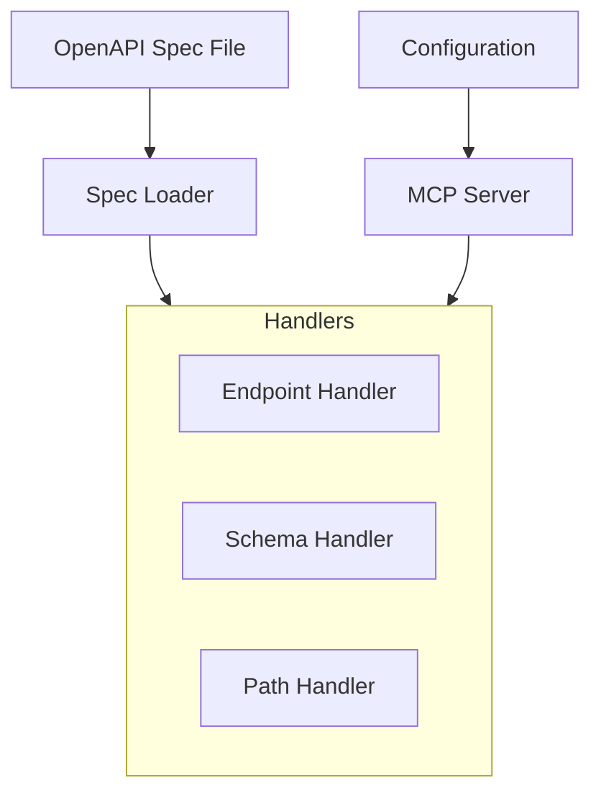

# System Patterns

## Architecture Overview

## Component Structure

### Services Layer
- SpecLoader: Loads and parses OpenAPI specifications
  - Uses swagger-parser for validation
  - Provides typed access to spec data
  - Handles file loading and caching

### Handler Layer
- EndpointHandler: Manages endpoint resources
  - Resource template definition
  - Request parameter handling
  - Response formatting
  - Error handling

### Configuration Layer
- Environment variables validation
- Server configuration
- Spec file path management

## Resource Design Patterns

### URI Structure
- Dynamic Resources:
  - `openapi://endpoint/{method}/{path}` - Get endpoint details
  - `openapi://schema/{name}` - Get schema details

### Response Format Patterns
1. JSON-based responses for all resources
2. Consistent structure across resources
3. Strong typing with OpenAPI v3 types
4. Clear error messages

## Extension Points
1. Spec loader for different formats
2. Resource handlers for new resource types
3. Response formatters for different outputs

## Testing Strategy
1. Unit Tests
   - Handler tests
   - Service tests
   - Configuration tests
   - Type validation tests

2. Integration Tests
   - Resource handler integration
   - Service integration
   - Error handling scenarios

3. E2E Tests
   - Complete server functionality
   - Complex paths and parameters
   - Edge cases and errors

4. Test Support
   - Test fixtures and samples
   - Mock implementations
   - Helper utilities
   - Common test patterns
